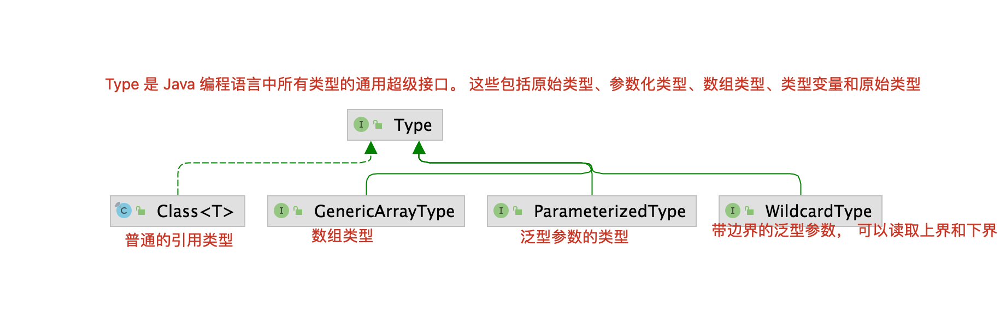

# 泛型
> 泛型是一种 “模版”代码技术， 不同的语言实现方式不同, java语言采用擦拭法实现

# 特点
1. 泛型编写代码模板来适应任意类型
2. 编译器编译时类型检查, 编码时根据泛型的自动类型转换, 有效避免ClassCastException
3. `ArrayList<Number> 和 ArrayList<Integer> 没有任何继承关系`

⭐️ 理解静态语言的严谨性， 泛型技术在代码编译的时候就能监测一些常见的coding错误。 


# 擦拭法

​	不同语言对于泛型这种“模板”代码技术， 实现方式是不同的， 最终导致的结果就是使用时可能会有一些局限， 对于java来说， 采用的是擦拭法实现的泛型， 编译器的**安全检查**和运**行时的强制转换**都由编译器完成， 对于虚拟机来说执行的代码都是按照 Object 类型来对待。

## 局限

1. 泛型不能支持基本类型 <- 对于虚拟机来说， 都是Object， Object无法引用基础数据类型的值
2. 无法准确判断泛型的类型  List<String>.getClass() == List<Integer>.getClass() 返回的都是同一个class对象。
3. 无法直接实例化 `new T()` 这种代码编译器会报错。
4. T[] ts = (T[]) new Object()[] ;


# 读取父类泛型 ⭐️

> 读取父类泛型的操作，在很多框架和底层代码是常见的， 例如编写MVC中的 BaseController<T> , BaseDao<T>。

## java中表达类型的继承树



## 实例代码

​	 如何读取泛型参数， 并实例化。

```java
import java.lang.reflect.InvocationTargetException;
import java.lang.reflect.ParameterizedType;
import java.lang.reflect.Type;

public class BaseDao<T> {

    private Class<T> entityType;

    public BaseDao(){
        // 具体子类实例化时,会执行读取泛型参数的代码
        Class<? extends BaseDao> subClazz = this.getClass();
        // 读取通用父类
        Type type = subClazz.getGenericSuperclass();
        // 如果是带泛型的类型
        if (type instanceof ParameterizedType) {
            // 转换成泛型类型
            ParameterizedType parameterizedType = (ParameterizedType) type;
            // 读取泛型参数数组
            Type[] types = parameterizedType.getActualTypeArguments();
            if (types.length == 0) {
                throw new RuntimeException("泛型参数读取失败~");
            }
            entityType = (Class<T>) types[0];
        }
    }

    public int insert(T t) {
        try {
            // 通过class来创建实例
            t = entityType.newInstance();
            // 子类需要的类型
            String subClassName = t.getClass().getSimpleName();
            System.out.println(subClassName);
        } catch (Exception e) {
            e.printStackTrace();
        }
        return 0;
    }

    public static void main(String[] args) {
        UserDao userDao = new UserDao();
        PersonDao personDao = new PersonDao();
        userDao.insert(new User()); // User
        personDao.insert(new Person()); // Person
    }
}

class UserDao extends BaseDao<User> {}
class PersonDao extends BaseDao<Person> {}
class User {}
class Person {}
```

